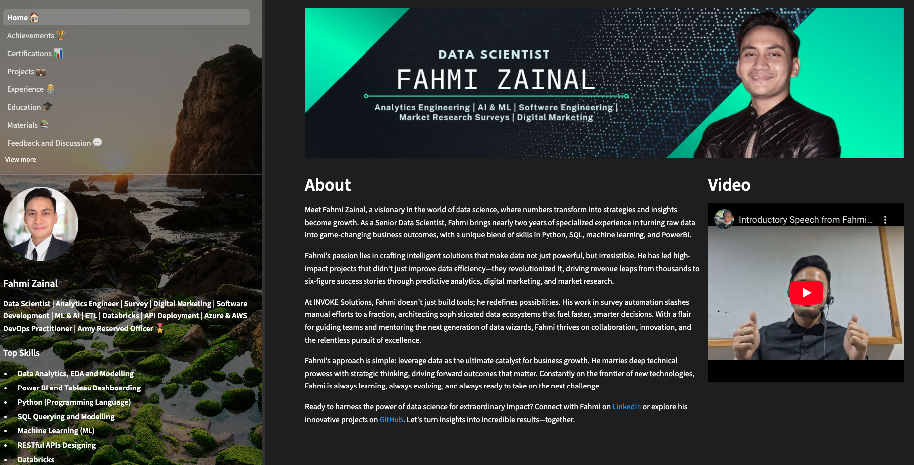

<!-- Greeting and Introduction -->
<h1 align="center">Greetings to everyone, I'm Fahmi Zainal</h1>
<h3 align="center">Data Scientist | Analytics Engineer | Survey | Digital Marketing | Software Development | ML & AI | ETL | Databricks | API Deployment | Azure & AWS DevOps Practitioner | Second Lieutenant Reserved Officer 🎖 </h3>


<!-- Badge to Follow on GitHub -->
<div align="center">
    <a href="https://github.com/fahmizainal17">
        
    </a>
</div>


<!-- Badge to Visit My Portfolio -->
<div align="center"> 
    <a href="https://fahmizainal-portfolio.streamlit.app/">
        
    </a>
</div>

<div align="center">
    <!-- Image as a link -->
    <a href="https://img.shields.io/badge/Visit%20My%20Portfolio-Streamlit%20App-brightgreen?style=for-the-badge&logo=streamlit">
        
    </a>
</div>

<!-- Profile Views -->
<p align="left">  </p>

<p align="left"> 
    <a href="https://github.com/ryo-ma/github-profile-trophy">
        
    </a> 
</p>

---

## 🌱 Professional Development
### INVOKE SOLUTIONS, Kuala Lumpur (November 2023 – Now)
#### Data Scientist
**Surveys Making, Automation and Optimization:**
- Led the design and implementation of the IVR Data Cleaner, Questionnaire Definer, and Keypress Decoder, significantly improving the efficiency of data processes from 8 hours to 30 minutes.
- Spearheaded and handled survey projects for call sampling, weighting, and visualization through crosstabs and charts utilizing Google Colab, Azure Databricks, and in-house web applications.
- Developed and integrated Unified Survey web applications using Streamlit, enhancing collaboration by merging functionalities with team-developed applications in Streamlit and Shiny Apps utilizing FastAPI, supported by Docker, AWS Services, and GitHub Actions (CI/CD).
- Architected data structure and profiling for utilizing data mining techniques and Geocoding API to map the locality (latitude and longitude) and postcode and other demographics data.
- Taught and guided interns for in-house training in conducting surveys and utilizing Streamlit for proof of concept.

**Machine Learning Development:**
- Prepared data, pipelines, designed, and developed predictive models to analyze ROAS Benchmark and Campaign Benchmark, consumer behaviors, and market trends utilizing MongoDB, Databricks, Azure Blob Storage for workflow, and using advanced matching and machine learning techniques, thus enhancing the company’s revenue by up to 10% by engaging potential regular clients.
- Created innovative EDA and model deployment to predict Personal Attributes such as Salary and Income Group, improving demographic targeting accuracy to up to 90% accuracy.

**ROAS Dashboard Application:**
- Streamlined and innovated solutions for the ROAS Dashboard application to deliver more precise and filtered results. Enhanced interactivity with users by providing clear graphs for visualization.
- Worked with Frontend Developer and interacted by creating API Endpoints of the functions to pass the data as of difference in packages usage.

**Computer Vision Applications Maintenance:**
- Maintained computer vision projects of FGV oil palm company to optimize the pesticide application.
- Maintained document parsing automation by implementing TensorFlow and YOLOv5 technologies, facilitating the digitization of invoices and receipts into structured formats for detailed analysis.

**Data Warehouse Management:**
- Oversaw the maintenance of the INVOKE’s data warehouse, ensuring robust integration and customization of dashboards to optimize data analytics capabilities.

### EXCELERATE ASIA, Kuala Lumpur (September 2023 – October 2023 Excelerate Asia)
#### Data Analyst (General Assembly)
- Workforce Dynamics Insights Project: Enhanced data integrity and workforce management through expert data wrangling with Excel and development of Interactive Tableau Dashboards, providing crucial insights into Retention, Compensation Fairness, and Diversity.
- Global Superstore SQL Project: Leveraged PostgreSQL for robust data management and extraction to Tableau, analyzing trends in product returns to support strategic business decisions thus completing analytics bootcamp training.

## 🏆 Achievements
### KAGGLE WORLD COMPETITION, Online (April 2022 – June 2023)
#### Data Scientist
- Achieved top 28% ranking out of 1908 teams in a Binary Prediction Competition on Smoker Status Using Bio-Signals, leveraging logistic regression, random forest, and tree-boosted algorithms such as Gradient Boosting, LightGBM, XGBoost, and CatBoost.
- Planned the work meticulously, conducting nightly meetings to discuss strategies, optimize models using Optuna for hyperparameter tuning, and implement a weighted voting classifier for enhanced performance, resulting in an ROC-AUC score of 0.87178 which is 87% accuracy.

## 🛡 Leadership
### MALAYSIAN ARMED FORCE, Kuala Lumpur (September 2019 – February 2023)
#### Second Lieutenant Reserved Army
- Leadership: Commanded a platoon of 89 cadets, achieving high training ratings and improving administrative efficiency, reducing errors by 5%.
- Communication: Excelled in high-pressure scenarios, coordinating team efforts and earning recognition for leadership during critical simulations.

---

- 📝 I regularly write articles on [www.linkedin.com/in/muhammadfahmibinmohdzainal](https://www.linkedin.com/in/muhammadfahmibinmohdzainal)

- 💬 Ask me about **Data Science, Data Analysis, Physics, Military, Silat Cekak, Skop Production Movies 😅**

- 📫 How to reach me **fahmizainal9@gmail.com**

- 📄 Know about my experiences [www.linkedin.com/in/muhammadfahmibinmohdzainal](https://www.linkedin.com/in/muhammadfahmibinmohdzainal)

- ⚡ Fun fact **I love listening to podcasts, reading articles, watching educational content to upgrade my skills in Data Analytics, Data Science, Data Engineering, and Business because that is what I'm passionate about. Not to mention, I love fishing and snorkeling.**

- 🔐 My Expertise
<table>
  <tr>
    <th>Area</th>
    <th>Technologies/Tools</th>
  </tr>
  <tr>
    <td>IVR and Calls Analytics</td>
    <td>Google Colab, Streamlit Web Application, Visual Studio Code, Google Sheet API, Google Sheet Dashboard, DataBricks, PySpark</td>
  </tr>
  <tr>
    <td>Languages</td>
    <td>Python, SQL, R, Html5, CSS3, JavaScript</td>
  </tr>
  <tr>
    <td>Cloud & Databases</td>
    <td>Databricks, AWS API Gateway, AWS Fargate, AWS S3, AWS EC2, AWS ECR, AWS ECS, PostgreSQL</td>
  </tr>
  <tr>
    <td>Data Processing</td>
    <td>PySpark</td>
  </tr>
  <tr>
    <td>Dashboarding</td>
    <td>Excel, Google Sheet, Google Colab, PowerBI, Tableau</td>
  </tr>
  <tr>
    <td>Web Development</td>
    <td>Streamlit Web App, FastAPI</td>
  </tr>
  <tr>
    <td>Containerization</td>
    <td>Docker</td>
  </tr>
</table>

<h3 align="left">Connect with me:</h3>
<p align="left">
<a href="https://twitter.com/fahmizainal17_" target="blank"></a>
<a href="https://linkedin.com/in/muhammadfahmibinmohdzainal" target="blank"></a>
<a 
href="https://kaggle.com/fahmizainal" target="blank"></a>
<a href="https://fb.com/fahmizainal" target="blank"></a>
<a href="https://instagram.com/fahmizainal17" target="blank"></a>
<a href="https://www.youtube.com/c/@fahmizainal7695" target="blank"></a>
</p>

<h3 align="left">Languages and Tools:</h3>
<p align="left">
    <a href="https://aws.amazon.com" target="_blank" rel="noreferrer">
        
    </a>
    <a href="https://azure.microsoft.com/en-in/" target="_blank" rel="noreferrer">
        
    </a>
    <a href="https://www.w3schools.com/cpp/" target="_blank" rel="noreferrer">
        
    </a>
    <a href="https://firebase.google.com/" target="_blank" rel="noreferrer">
        
    </a>
    <a href="https://cloud.google.com" target="_blank" rel="noreferrer">
        
    </a>
    <a href="https://hadoop.apache.org/" target="_blank" rel="noreferrer">
        
    </a>
    <a href="https://www.w3.org/html/" target="_blank" rel="noreferrer">
        
    </a>
    <a href="https://developer.mozilla.org/en-US/docs/Web/JavaScript" target="_blank" rel="noreferrer">
        
    </a>
    <a href="https://www.mathworks.com/" target="_blank" rel="noreferrer">
        
    </a>
    <a href="https://opencv.org/" target="_blank" rel="noreferrer">
        
    </a>
    <a href="https://pandas.pydata.org/" target="_blank" rel="noreferrer">
        
    </a>
    <a href="https://www.postgresql.org" target="_blank" rel="noreferrer">
        
    </a>
    <a href="https://www.python.org" target="_blank" rel="noreferrer">
        
    </a>
    <a href="https://pytorch.org/" target="_blank" rel="noreferrer">
        
    </a>
    <a href="https://scikit-learn.org/" target="_blank" rel="noreferrer">
        
    </a>
    <a href="https://seaborn.pydata.org/" target="_blank" rel="noreferrer">
        
    </a>
    <a href="https://www.selenium.dev" target="_blank" rel="noreferrer">
        
    </a>
    <a href="https://www.tensorflow.org" target="_blank" rel="noreferrer">
        
    </a>
</p>

<h3 align="left">🌟 Support My Work:</h3>
<table>
    <tr>
        <td colspan="2">
            <a href="https://www.buymeacoffee.com/fahmizaina8">
                
            </a>
        </td>
    </tr>
    <tr>
        <td>
            
        </td>
        <td rowspan="2">
            
        </td>
    </tr>
    <tr>
        <td>
            
        </td>
    </tr>
</table>

---

## 🚀 **My Wakatime This Week!**

[](https://wakatime.com/@ae82a943-125e-489a-a656-e35fe84d587b)
[](https://github.com/fahmizainal17)
[](https://github.com/fahmizainal17?tab=repositories)

### 📊 **This Week I Spent My Time On:**

<!--START_SECTION:waka-->

```txt
From: 03 September 2024 - To: 10 September 2024

Total Time: 58 mins

Python   58 mins         █████████████████████████   100.00 %
```

<!--END_SECTION:waka-->

---
